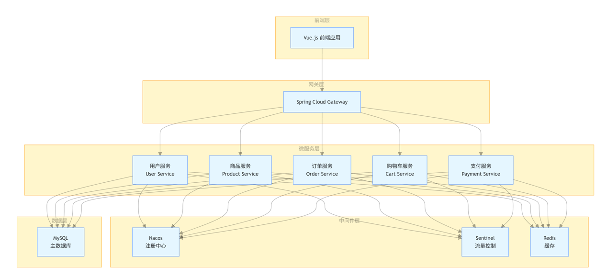

# 🛒 VnollxShop 电商系统

<div align="center">


**基于 Spring Cloud Alibaba 微服务架构的现代化电商系统**

[项目演示](#项目演示) • [技术栈](#技术栈) • [系统架构](#系统架构) • [功能特性](#功能特性) • [快速开始](#快速开始)

</div>

---

## 📖 项目简介

VnollxShop 是一个基于 Spring Cloud Alibaba 微服务架构开发的现代化电商系统，旨在学习和实践微服务技术栈。系统采用前后端分离架构，提供完整的电商业务流程，包括商品管理、用户管理、订单处理、支付集成、秒杀活动等核心功能。

## 🎯 项目演示

### 主要功能展示

- **🏠 商品展示**：精美的商品列表和详情页面
- **🛒 购物车**：完整的购物车功能
- **⚡ 秒杀专区**：每天 12:00-14:00 限时秒杀活动
- **👤 用户中心**：个人信息管理、订单查看
- **💳 支付系统**：支持支付宝、微信支付
- **📱 响应式设计**：完美适配移动端和桌面端

## 🛠 技术栈

### 后端技术

| 技术 | 版本 | 说明 |
|------|------|------|
| Spring Cloud Alibaba | 2021.0.3.0 | 微服务框架 |
| Spring Boot | 2.7.0 | 基础框架 |
| Spring Cloud Gateway | 2021.0.3 | API 网关 |
| Nacos | 2.1.0 | 服务注册与配置中心 |
| Sentinel | 1.8.4 | 流量控制和熔断 |
| MyBatis Plus | 3.5.2 | ORM 框架 |
| MySQL | 8.0 | 关系型数据库 |
| Redis | 6.0 | 缓存数据库 |
| Docker | 20.10+ | 容器化部署 |

### 前端技术

| 技术 | 版本 | 说明 |
|------|------|------|
| Vue.js | 2.6.14 | 前端框架 |
| Element UI | 2.15.6 | UI 组件库 |
| Vue Router | 3.5.1 | 路由管理 |
| Axios | 0.27.2 | HTTP 客户端 |
| Vuex | 3.6.2 | 状态管理 |

## 🏗 系统架构




## ✨ 功能特性

### 🛍 商品管理
- **商品展示**：支持商品列表、分类筛选、搜索功能
- **商品详情**：详细的商品信息展示
- **库存管理**：实时库存监控和预警
- **商品评价**：用户评价和点赞系统

### ⚡ 秒杀系统
- **限时秒杀**：每天 12:00-14:00 限时秒杀活动
- **限购控制**：每人限购 1 件秒杀商品
- **实时倒计时**：精确到秒的倒计时显示
- **库存保护**：防止超卖机制

### 🛒 购物车系统
- **商品管理**：添加、删除、修改商品数量
- **实时同步**：购物车数据实时同步
- **批量操作**：支持批量删除和结算

### 📦 订单系统
- **订单创建**：支持直接购买和购物车下单
- **订单状态**：完整的订单状态流转
- **订单查询**：用户订单历史查询
- **收货管理**：收货地址管理

### 👤 用户系统
- **用户注册**：支持邮箱注册
- **用户登录**：JWT Token 认证
- **个人信息**：头像上传、信息修改
- **账户充值**：支持支付宝、微信支付

### 💳 支付系统
- **多种支付**：支持支付宝、微信支付
- **支付回调**：异步支付结果处理
- **订单关联**：支付与订单状态同步

## 🚀 快速开始

### 环境要求

- JDK 1.8+
- Maven 3.6+
- Node.js 14+
- MySQL 8.0+
- Redis 6.0+
- Docker 20.10+ (可选)

### 1. 克隆项目

```bash
git clone https://github.com/your-username/VnollxShop.git
cd VnollxShop
```

### 2. 数据库初始化

```sql
-- 创建数据库
CREATE DATABASE vnollx_shop DEFAULT CHARACTER SET utf8mb4 COLLATE utf8mb4_unicode_ci;

-- 导入数据库脚本
mysql -u root -p vnollx_shop < sql/vnollx_shop.sql
```

### 3. 启动中间件

```bash
# 启动 Nacos
docker run -d --name nacos -p 8848:8848 -e MODE=standalone nacos/nacos-server:v2.1.0

# 启动 Redis
docker run -d --name redis -p 6379:6379 redis:6.0-alpine
```

### 4. 启动后端服务

```bash
# 启动网关服务
cd gateway
mvn spring-boot:run

# 启动用户服务
cd user
mvn spring-boot:run

# 启动商品服务
cd product
mvn spring-boot:run

# 启动订单服务
cd order
mvn spring-boot:run

# 启动购物车服务
cd card
mvn spring-boot:run
```

### 5. 启动前端应用

```bash
cd front
npm install
npm run serve
```

### 6. 访问应用

- **前端应用**：http://localhost:8080
- **Nacos 控制台**：http://localhost:8848/nacos (nacos/nacos)
- **API 文档**：http://localhost:8080/swagger-ui.html

## 📁 项目结构

```
VnollxShop/
├── gateway/                 # API 网关服务
├── user/                   # 用户服务
├── product/                # 商品服务
├── order/                  # 订单服务
├── card/                   # 购物车服务
├── middleware/             # 中间件服务
├── common/                 # 公共模块
├── front/                  # 前端应用
│   ├── src/
│   │   ├── components/     # 公共组件
│   │   ├── views/          # 页面组件
│   │   ├── api/            # API 接口
│   │   └── utils/          # 工具类
│   └── public/             # 静态资源
├── sql/                    # 数据库脚本
├── docker-compose.yml      # Docker 编排文件
└── README.md              # 项目说明
```

## 🔧 配置说明

### 数据库配置

```yaml
spring:
  datasource:
    url: jdbc:mysql://localhost:3306/vnollx_shop?useUnicode=true&characterEncoding=utf8&serverTimezone=Asia/Shanghai
    username: root
    password: your_password
    driver-class-name: com.mysql.cj.jdbc.Driver
```

### Redis 配置

```yaml
spring:
  redis:
    host: localhost
    port: 6379
    password: 
    database: 0
```

### Nacos 配置

```yaml
spring:
  cloud:
    nacos:
      discovery:
        server-addr: localhost:8848
      config:
        server-addr: localhost:8848
        file-extension: yaml
```

## 🐳 Docker 部署

### 使用 Docker Compose

```bash
# 启动所有服务
docker-compose up -d

# 查看服务状态
docker-compose ps

# 停止所有服务
docker-compose down
```

### 单独部署

```bash
# 构建镜像
docker build -t vnollx-shop-gateway ./gateway
docker build -t vnollx-shop-user ./user
docker build -t vnollx-shop-product ./product
docker build -t vnollx-shop-order ./order
docker build -t vnollx-shop-card ./card

# 运行容器
docker run -d --name gateway -p 8080:8080 vnollx-shop-gateway
docker run -d --name user -p 8081:8081 vnollx-shop-user
docker run -d --name product -p 8082:8082 vnollx-shop-product
docker run -d --name order -p 8083:8083 vnollx-shop-order
docker run -d --name card -p 8084:8084 vnollx-shop-card
```

## 📊 性能优化

### 缓存策略
- **Redis 缓存**：商品信息、用户信息缓存
- **本地缓存**：热点数据本地缓存
- **CDN 加速**：静态资源 CDN 分发

### 数据库优化
- **读写分离**：主从数据库分离
- **分库分表**：大数据量分片存储
- **索引优化**：合理创建数据库索引

### 接口优化
- **接口限流**：Sentinel 流量控制
- **熔断降级**：服务熔断保护
- **异步处理**：耗时操作异步化

## 🤝 贡献指南

1. Fork 本仓库
2. 创建特性分支 (`git checkout -b feature/AmazingFeature`)
3. 提交更改 (`git commit -m 'Add some AmazingFeature'`)
4. 推送到分支 (`git push origin feature/AmazingFeature`)
5. 打开 Pull Request

## 📝 更新日志

### v1.0.0 (2024-01-01)
- ✨ 初始版本发布
- 🛍 基础商品管理功能
- 👤 用户注册登录系统
- 🛒 购物车功能
- 📦 订单管理系统
- ⚡ 秒杀活动功能
- 💳 支付系统集成

## 📄 许可证

本项目采用 MIT 许可证 - 查看 [LICENSE](LICENSE) 文件了解详情

## 👨‍💻 作者

**Vnollx**
- GitHub: [@vnollx](https://github.com/vnollx)
- Email: 2720741614@qq.com

## 🙏 致谢

感谢以下开源项目的支持：
- [Spring Cloud Alibaba](https://github.com/alibaba/spring-cloud-alibaba)
- [Vue.js](https://vuejs.org/)
- [Element UI](https://element.eleme.io/)
- [MyBatis Plus](https://baomidou.com/)

---

<div align="center">

**⭐ 如果这个项目对你有帮助，请给它一个 Star！**

Made with ❤️ by Vnollx

</div>